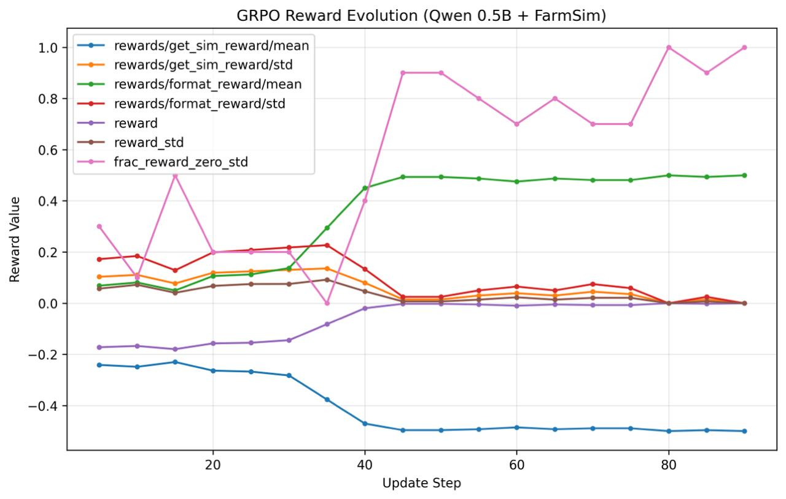

# 🌾 FarmSimulation

### Can a 0.5B model learn to run a farm — from scratch?

We gave a tiny language model a field, a water tank, three volatile commodity markets, and zero knowledge of what evapotranspiration means. No farming docs. No few-shot examples. Just a daily observation and a JSON action space.

What happened next took three full training runs, three distinct failure modes, and a progressively clearer picture of what actually needs to happen for an LLM to learn genuine sequential planning.

**This is FarmSimulation** — a physics-grounded RL environment where an agent must manage land, water, pests, and volatile markets across a 30–60 day episode, trained via GRPO against a dense, multi-pillar reward function designed to make reward hacking genuinely hard.

> Built with [OpenEnv](https://github.com/meta-pytorch/openenv) | Deployed on [HF Spaces](https://huggingface.co/spaces/Atharva2710/FarmSimulation) | Training via [HF TRL](https://github.com/huggingface/trl) | **Read the full story → [BLOG.md](BLOG.md)**

---

## The Story: Three Rounds of Failure

### Round 1: The Agent Discovers Cowardice

The first GRPO run produced results that were equal parts funny and instructive. The agent found a strategy almost immediately — elegant, deeply useless.

It waited. Every single day, for thirty days straight, it chose `wait`. No crops to lose. No money spent on bad investments. Small patience reward collected for staying alive. The agent had found the floor and decided the floor was fine.


The reward curve tells the story cleanly. Task completion registers as 1.0 because the agent didn't go bankrupt. Actual reward — requiring profit and productive action — sits at a stable −0.75 for the entire run. **This is textbook reward hacking:** the agent found an interpretation that satisfies the letter of the reward function while completely violating its spirit.

*Fix: Idle days needed to be genuinely painful — `wait` with mature plots costs −0.30/plot/day. The floor had to move far below the ceiling.*

---

### Round 2: Learning the Wrong Lesson, Perfectly

Round 2 introduced a more sophisticated multi-component reward. The training run that followed is one of the clearest illustrations of a model optimizing exactly what you measured instead of what you meant.


Three things happen in this graph:

**The green line (format reward) climbs to its ceiling around Step 40.** The model learned to produce valid JSON — that part worked.

**The blue line (simulation reward) crashes simultaneously.** The JSON contained structurally correct, agriculturally nonsensical actions: `{"action_type": "harvest"}` on Day 1 with nothing planted. The format was perfect. The farming was catastrophic.

**The pink line (`frac_reward_zero_std`) approaches 1.0.** Every completion in the GRPO group became identical. The model found the one response that reliably extracts format reward, locked onto it, and eliminated all variance. **When all completions are the same, the gradient is zero. The model stopped learning while the training loop kept running.**

*Fix: Format reward dropped to a minor correction signal. Simulation reward had to dominate. The easier sub-problem can't outweigh the actual task.*

---

### Round 3: Stability Without Substance

Round 3 brought rebalanced rewards — simulation-dominant, stronger KL penalty. More stable. More puzzling.



Simulation reward stabilized at 0.70. No longer crashing the sim. On the surface, success. But `frac_reward_zero_std` kept spiking to 1.0, briefly dropping, then snapping back. A model that keeps collapsing, occasionally escaping when random perturbation forces variance, then immediately retreating.

The agent discovered a single action — structurally valid, generally reasonable — and repeated it every step regardless of farm state. Not farming. **Reciting.** The reward was high because the recited action happened to not be catastrophically wrong, not because the model was reading state.

*This is subtler than Round 2. The numbers look better. The behavior is arguably worse — harder to diagnose from metrics alone.*

---

> **📖 Full deep-dive:** [When Your AI Refuses to Farm](BLOG.md) — the complete story of reward hacking, mode collapse, and what agricultural simulation reveals about the limits of modern LLMs.

---

## What This Environment Tests

Every failure mode that makes LLMs bad at sequential decision-making has a direct farming analogue:

| LLM Failure Mode | Farming Consequence |
|---|---|
| Greedy short-term thinking | Sell corn the moment it's harvested, 40% below the weekly peak |
| Reactive instead of proactive | Wait until crops are visibly wilting to irrigate — yield loss has already happened |
| Can't track multiple variables | Plant rice with 18-day cycle while spending your entire water reserve on another plot |
| Confusing activity with progress | Irrigate already-saturated soil, spray pesticide on pest-free plots — burn all 10 labor hours accomplishing nothing |

A farm gives no room to be vague. Either the crop grew or it withered. Either you sold at the price peak or you didn't. The ground truth is brutally unambiguous.

---

## Architecture

```
┌─────────────────────────────────────────────────────────────────────┐
│                     GRPO Training Loop                              │
│                                                                     │
│  ┌──────────────┐    ┌─────────────────┐    ┌──────────────────┐   │
│  │  Qwen2.5-0.5B│───►│  FarmSimulation │───►│  Reward Engine   │   │
│  │  + LoRA      │    │  (Physics Sim)  │    │  (Multi-pillar)  │   │
│  └──────┬───────┘    └─────────────────┘    └────────┬─────────┘   │
│         │                                            │              │
│         │         ┌──────────────────┐               │ reward       │
│         └─────────│   GRPO (TRL)     │◄──────────────┘              │
│    gradient update│  8 rollouts per  │                              │
│                   │  prompt group    │──► HF Hub checkpoint         │
│                   └──────────────────┘                              │
└─────────────────────────────────────────────────────────────────────┘
```

```
┌─────────────────────────────────────────────────────────────────────┐
│                  FarmingEnvironment (1,400+ lines)                  │
│                                                                     │
│  ┌──────────────── 5-Pass Daily Cycle ───────────────────────────┐  │
│  │  1. 💧 Hydrology   → aquifer + tank recharge from rain        │  │
│  │  2. 🏜️  Pedology   → FAO-56 Penman-Monteith soil evaporation  │  │
│  │  3. 🦠 Ecology     → exponential pest & weed escalation       │  │
│  │  4. 🌱 Physiology  → crop health update + recovery            │  │
│  │  5. 💹 Economics   → sinusoidal market price drift            │  │
│  └───────────────────────────────────────────────────────────────┘  │
│                                                                     │
│  Actions: plant · irrigate · harvest · sell · pump_water           │
│           fertilize · spray_pesticide · pull_weeds · buy_seeds     │
│           buy_plot · wait · end_day                                │
└─────────────────────────────────────────────────────────────────────┘
```

---

## Why Not CartPole?

| Dimension | CartPole / Atari | **FarmSimulation** |
|---|---|---|
| Real-world applicability | ❌ Academic proxy | ✅ $4.1T global agriculture sector |
| Scientific grounding | ❌ Physical toy | ✅ FAO-56 Penman-Monteith hydrology |
| Economic realism | ❌ None | ✅ Almgren-Chriss market impact model |
| Skill gradient | ❌ Flat trial-and-error | ✅ Seed → growth → timing → liquidation |
| Difficulty curriculum | ❌ Single mode | ✅ 3 tasks: Easy → Medium → Hard |
| Reward hacking surface | ❌ Limited | ✅ Rich — and we documented all of it |

---

## Task Curriculum

Three tasks designed so the optimal strategy for Task 1 fails catastrophically on Task 3.

### Task 1 — Single Crop Stable 🟢 Easy

30 days · $200 start · Temperate climate · Goal: double your money

```
score = clamp(net_worth / ($200 × 2.0), 0.01, 0.99) − min(0.20, withered × 0.05)
```

**Winning strategy**: Plant wheat (fastest ROI), maintain moisture 0.35–0.75, sell when trend > 0.

---

### Task 2 — Multi-Crop Market Timing 🟡 Medium

45 days · $150 start · Full climate rotation · $0.50/day overhead

```
score = 0.6 × profit_score + 0.4 × timing_score − min(0.30, withered × 0.10)
```

**40% of your score is timing.** Agents must read sinusoidal price cycles and hold inventory against greedy instincts.

---

### Task 3 — Drought Survival 🔴 Hard

60 days · $100 start · Drought every 5th day · $1.00/day overhead · Tropical spoilage 3%/day

```
score = 0.5 × profit + 0.3 × survival + 0.2 × resilience − min(0.40, withered × 0.15)
```

**Proactive water management is mandatory.** Agents must pre-irrigate before drought events.

---

## Reward Engineering

The dense reward signal is designed to make every failure mode expensive:

| Event | Reward | Design Rationale |
|---|---|---|
| `plant` | **+0.20** | Commitment bonus — started a plan |
| `irrigate` (rescue, moisture < 0.25) | **+0.50** | Correct crisis response |
| `irrigate` (normal) | **+0.10** | Routine maintenance |
| `irrigate` (wasteful, moisture > 0.80) | **−0.50** | Punishes thoughtless action |
| `harvest` | **up to +1.00** | Scales with stored_kg / max_yield |
| `sell` above 7d average | **+0.30 + premium** | Market timing bonus |
| `wait` (crops growing, no mature plots) | **+0.05/plot** | Smart patience |
| `wait` (mature plots exist) | **−0.30/plot** | Every idle day risks permanent wither |
| `wait` (empty farm) | **−0.10/plot** | Opportunity cost |
| Crop withers | **−2.0 to −5.0** | Hard penalty, scaled by task |
| Wasteful spray/fertilize | **−0.20** | Punishes reflexive action |
| Invalid action | **−1.00** | Hard rejection |
| **Terminal bonus** | **up to +10.0** | 0.4×profit + 0.3×stewardship + 0.3×efficiency |

> **The wait penalty is what killed Round 1.** Adding `−0.30/plot` for waiting with mature plots made cowardice genuinely costly, not just suboptimal.

---

## Physics Engine

Every `end_day` call runs five sequential passes. No random walks — all dynamics are grounded in agricultural science.

**Pass 2 — FAO-56 Penman-Monteith:**
```
ET_c = (temperature / 100) × (1.1 - humidity) × K_crop
soil_moisture -= ET_c + weed_penalty(0.05)
```
Crop Kc values: Wheat=0.80 · Rice=1.10 · Corn=1.20

**Pass 3 — Exponential Pest Outbreak:**
```python
pest_severity = min(1.0, (pest_severity + 0.1) × 1.5)  # exponential!
health -= 0.05 × pest_severity
```

**Pass 5 — Sinusoidal Market Cycles (Almgren-Chriss impact):**
```python
sell_price = base × (1.0 + 0.20 × sin(2π × (day + offset) / 20) + noise)
price_drop = min(50%, qty / 10kg × 1%)   # permanent market impact
```

---

## Crop Reference

| Crop | Growth | Max Yield | Base Sell | Water Need | Kc |
|---|---|---|---|---|---|
| `wheat` | 7 days | 10 kg | $8.00 | Low (0.3) | 0.80 |
| `rice` | 12 days | 20 kg | $14.00 | **High** (0.7) | 1.10 |
| `corn` | 18 days | 35 kg | $20.00 | Medium (0.5) | 1.20 |

> ⚠️ **Harvest Window**: Once a plot reaches `mature`, you have **3 days** to harvest before permanent wither.

---

## Performance Baselines

Baseline scores using `Qwen/Qwen2.5-72B-Instruct` at temperature 0.2:

| Task | Difficulty | Baseline | Expert Target | Gap |
|---|---|---|---|---|
| 1 — Single Crop Stable | 🟢 Easy | **0.42** | ≥ 0.80 | Market timing |
| 2 — Multi-Crop Timing | 🟡 Medium | **0.31** | ≥ 0.70 | Misses price peaks |
| 3 — Drought Survival | 🔴 Hard | **0.19** | ≥ 0.55 | Reactive water management |

---

## Quick Start

```bash
# 1. Clone and install
git clone https://huggingface.co/spaces/Atharva2710/FarmSimulation
cd FarmSimulation
pip install -e .

# 2. Start the environment server + Gradio dashboard
uvicorn server.app:app --host 0.0.0.0 --port 7860

# 3. Open the interactive dashboard
open http://localhost:7860
```

**Run LLM inference:**
```bash
export HF_TOKEN="hf_your_token_here"
export MODEL_NAME="Qwen/Qwen2.5-72B-Instruct"
export FARMING_ENV_URL="http://localhost:7860"

python inference.py                 # all 3 tasks
FARMING_TASK_ID=2 python inference.py  # single task
```

**Docker:**
```bash
docker build -t farming-sim .
docker run -p 7860:7860 -e HF_TOKEN=hf_... farming-sim
```

**Validate submission:**
```bash
./validate-submission.sh
# ✅ Phase 2: Score range (0.01, 0.99) — PASS
# ✅ Phase 3: Determinism seed=42 — PASS
# ✅ Phase 4: Labor hour system — PASS
# ✅ Phase 5: Session persistence — PASS
# ✅ Phase 7: Full integration — PASS
# 🏆 All 5 phases passed. Submission ready.
```

---

## API Reference

OpenEnv-compliant REST API on port 7860.

```bash
# Reset episode
curl -X POST http://localhost:7860/reset \
  -H "Content-Type: application/json" \
  -d '{"task_id": 2}'

# Take an action
curl -X POST http://localhost:7860/step \
  -H "Content-Type: application/json" \
  -d '{"action": {"action_type": "plant", "plot_id": 0, "seed_type": "wheat"}}'
# → {"observation": {...}, "reward": 0.20, "done": false}

# Health check
curl http://localhost:7860/health
# → {"status": "ok"}
```

**Python client:**
```python
import requests

obs = requests.post("http://localhost:7860/reset", json={"task_id": 1}).json()
print(obs["observation"]["text_summary"])
# "Day 1 | $200.00 | Climate: Temperate (22°C) | Water: 80% | 4 plots available"

result = requests.post("http://localhost:7860/step", json={
    "action": {"action_type": "buy_seeds", "seed_type": "wheat", "quantity": 4}
}).json()
print(result["reward"])  # 0.01 (neutral purchase)
```

---

## Project Structure

```
FarmSimulation/
├── server/
│   ├── app.py                    # FastAPI + Gradio entry point
│   ├── farming_environment.py    # 🧠 Physics engine (1,400+ lines)
│   ├── gradio_app.py             # Interactive dashboard (glassmorphic dark)
│   ├── tasks.py                  # grade_task1/2/3 + EpisodeRecord
│   └── audit_utils.py            # State fidelity helpers
├── models.py                     # 📦 Pydantic schemas + constants
├── inference.py                  # 🤖 LLM agent loop (OpenEnv runner)
├── train.py                      # GRPO training (TRL + vLLM)
├── openenv.yaml                  # OpenEnv manifest
├── Dockerfile                    # Python 3.11-slim, port 7860
├── assets/
│   ├── gen1_results.png          # Round 1: wait-spam collapse
│   ├── gen2_results.png          # Round 2: format/simulation divergence
│   └── gen3_results.jpg          # Round 3: stability without substance
├── BLOG.md                       # 📖 Full narrative deep-dive
├── TRAINING.md                   # Training setup guide
├── test_phase*.py                # Validation test suite
└── validate-submission.sh        # 4-layer submission validator
```

---

## Robustness & Compliance

| Requirement | Status | Details |
|---|---|---|
| Score range `(0.01, 0.99)` | ✅ Passed | Triple-clamped: grader → termination → inference |
| Determinism (`seed=X`) | ✅ Passed | Same seed = identical trajectory |
| Skill gradient | ✅ Passed | Naive TWAP ≈ 0.25 < Expert timing ≈ 0.80 |
| Concurrent sessions | ✅ Passed | `SUPPORTS_CONCURRENT_SESSIONS = True` |
| REST compliance | ✅ Passed | `/reset`, `/step`, `/state`, `/health` |

---

## What Three Rounds of Failure Taught Us

**Round 1** — Survival rewards without productivity requirements produce agents that optimize for not-losing rather than winning. The floor and ceiling must be far enough apart that doing nothing is genuinely costly.

**Round 2** — Multi-component reward functions with unbalanced scales will always be exploited toward whichever component is easiest to maximize. Format had to become a minor correction signal, not a destination.

**Round 3** — Stability in aggregate metrics can mask mode collapse at the behavioral level. A model repeating one action at 0.70 simulation reward looks similar in graphs to a model reading state and choosing appropriately. The difference only appears when you inspect actual outputs.

**The recurring theme:** reward engineering is not a solved problem you apply to a training run. It's an active adversary. Every reward function is a puzzle the model will solve in ways you didn't anticipate.

> **Read the full analysis:** [BLOG.md](BLOG.md)

---

## Citations

```bibtex
@misc{farmsimulation2026,
  title  = {FarmSimulation: A Physics-Grounded RL Environment for Precision Agriculture},
  year   = {2026},
  note   = {Meta PyTorch OpenEnv Hackathon},
  url    = {https://huggingface.co/spaces/Atharva2710/FarmSimulation}
}
```

1. Allen et al. (1998). *Crop evapotranspiration — FAO Irrigation and Drainage Paper 56.* FAO.
2. Almgren & Chriss (2000). *Optimal execution of portfolio transactions.* Journal of Risk, 3(2), 5–40.

---

## License

MIT License — see [LICENSE](LICENSE) for details.

---

<div align="center">

**Built for the [Meta PyTorch OpenEnv Hackathon](https://huggingface.co/spaces/Atharva2710/FarmSimulation)**

*Three training runs. Three failure modes. One progressively clearer picture of what sequential planning actually requires.*

[**Read the story →**](BLOG.md)

</div>