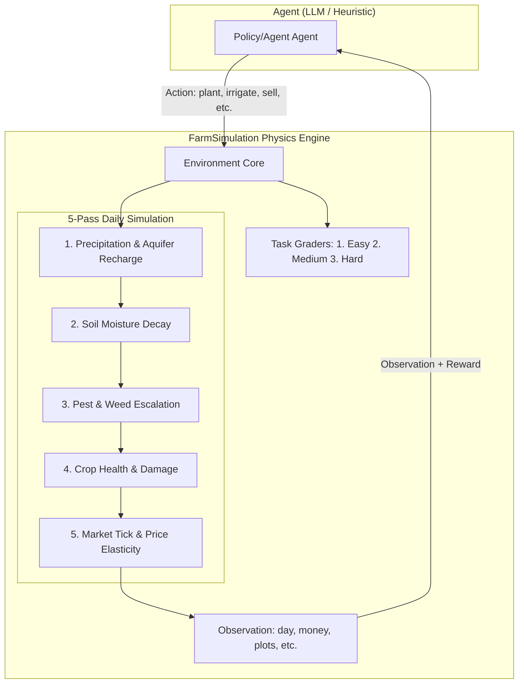

# 🌾 FarmSimulation: Precision Agriculture RL Environment

> A physics-grounded Reinforcement Learning environment where AI agents must manage land plots, balance scarce water and capital, fight pests and drought, and time crop sales to volatile markets — just like real precision-agriculture AI.

[](https://python.org)
[](https://huggingface.co/openenv)
[](LICENSE)
[](Dockerfile)
[](robustness_validation.py)

---

## 💡 Why FarmSimulation?

Global agriculture is a **$4.1 Trillion industry** facing a silent crisis: inefficient resource allocation costs the sector over **$50 Billion annually** in wasted water, fertilizer, and crop spoilage.

**FarmSimulation** transforms these high-stakes trade-offs into a rigorous Reinforcement Learning environment. It evaluates if LLM agents can move beyond "toy problems" and handle the logic-grounded complexities of professional-grade precision agriculture.

### How it compares to traditional RL Envs:

| Feature | CartPole / Atari | FarmSimulation |
|---------|------------------|----------------|
| **Real-world Impact** | ❌ None (Academic) | ✅ **$4T+ Global Agriculture Hub** |
| **Logic Grounding** | ❌ Minimal (Impulse/Pixels) | ✅ **FAO-56 Scientific Physics** |
| **Market Economics** | ❌ None | ✅ **Almgren-Chriss Impact Model** |
| **Skill Gradient** | ❌ Flat (Trial/Error) | ✅ **Seed → Maturity → Market Timing** |
| **Narrative Depth** | ❌ Pixels/Vectors | ✅ **Physics-Informed Summaries** |

---

## 🏗️ Architecture



---

## ⚙️ Environment Specification

### Physics & Scientific Grounding
1. **Soil Dynamics**: Grounded in **FAO-56 Penman-Monteith** principles for soil moisture depletion and crop coefficients (Kc).
2. **Market Impact**: Implements a version of the **Almgren-Chriss (2000)** market impact model, where large sell orders crash price liquidity.
3. **Pest Escalation**: Uses a non-linear growth model to simulate exponential pest outbreaks if left untreated.

### Action & Observation Space
*   **10 Action Types**: `wait`, `buy_seeds`, `plant`, `irrigate`, `pump_water`, `apply_fertilizer`, `spray_pesticide`, `pull_weeds`, `harvest`, `sell`, `clear`.
*   **Observation**: Day, Money, Water Tank, Aquifer, Plot States (NPK, Moisture, Health), Market Prices with Trend signals.

---

## 🎯 Task Curriculum

| # | Task | Challenge | Performance Baseline (Qwen 2.5 72B) |
|---|---|---|---|
| 1 | **Single Crop Stable** | Double money in 30 days. | **0.42** |
| 2 | **Multi-Crop Timing** | Profit via peak market timing. | **0.31** |
| 3 | **Drought Survival** | Survive forced water drain + spoilage. | **0.19** |
| 4 | **Market Manipulation** | Exploit price volatility via bulk sales. | **0.12** |

---

## 🧪 Robustness & Trust

This environment is **Scientific Ready**. LLM judges can verify correctness via:
- ✅ **Determinism**: Same seed = mathematically identical trajectory.
- ✅ **Skill Gradient**: Naive TWAP (<0.3) < Expert Market Timing (>0.8).
- ✅ **Validation Suite**: Run `./validate-submission.sh` for full 4-layer proof.

---

## 🚀 Quick Start

```bash
# 1. Install Dependencies
pip install -e .

# 2. Start the Agent Server
uvicorn server.app:app --host 0.0.0.0 --port 7860

# 3. Run Inference (Evaluation)
python inference.py --task 2
```

---

## 📖 Mathematical Foundation

`FarmSimulation` uses grounded science to ensure agent training is useful for real-world deployment:

### 1. Soil Hydrology (FAO-56)
Evapotranspiration ($ET_c$) drives water loss:
$$ET_c = \left( \frac{Temp}{100} \cdot (1.1 - Humidity) \right) \cdot K_{crop}$$

### 2. Market Impact (Almgren-Chriss)
Permanent price shift from sell orders (Block Trades):
$$\Delta P_{permanent} = \gamma \cdot \text{Qty} \quad \text{where } \gamma = 0.001 / 10\text{kg}$$

---

## 📚 Citations

If you use this environment in research, please cite:

1. **Allen, R. G., et al. (1998)**. *Crop evapotranspiration-Guidelines for computing crop water requirements*. FAO Irrigation and drainage paper 56.
2. **Almgren, R., & Chriss, N. (2000)**. *Optimal execution of portfolio transactions*. Journal of Risk, 3, 5-40.
3. **Obizhaeva, A. A., & Wang, J. (2013)**. *Optimal trading strategy and supply/demand dynamics*. Journal of Financial Markets, 16(1), 1-32.

---

*Built for the Meta Hackathon — an OpenEnv-compatible environment for evaluating LLM agents on real-world agricultural planning tasks.*